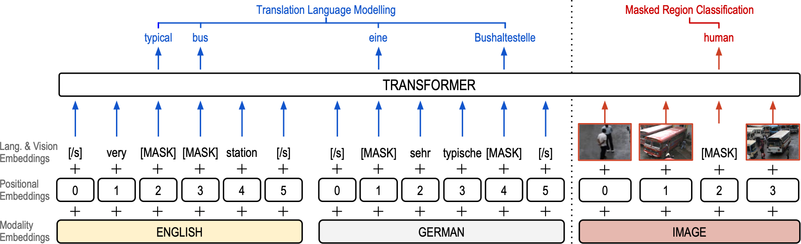

# VTLM


[Read the paper (EACL 2021)](https://arxiv.org/pdf/2101.10044.pdf)

Pre-trained language models have been shown to substantially improve performance in many natural language tasks. Although the early focus of such models was single language pre-training, recent advances have resulted in cross-lingual and visual pre-training methods. In this paper, we combine these two approaches to learn visually-grounded cross-lingual representations. Specifically, we extend the [translation language modelling](https://github.com/facebookresearch/XLM) (Lample and Conneau, 2019) with masked region classification, and perform pre-training with three-way parallel vision & language corpora. We show that when fine-tuned for multimodal machine translation, these models obtain state-of-the-art performance. We also provide qualitative insights into the usefulness of the learned grounded representations.

```
@inproceedings{caglayan-etal-2021-cross-lingual,
    title = {{Cross-lingual Visual Pre-training for Multimodal Machine Translation}},
    author = "Caglayan, Ozan and
              Kuyu, Menekse and
              Amac, Mustafa Sercan and
              Madhyastha, Pranava and
              Erdem, Erkut and
              Erdem, Aykut and
              Specia, Lucia",
    booktitle = "Proceedings of the 16th Conference of the {E}uropean Chapter of the Association for Computational Linguistics: Short Papers",
    month = apr,
    year = "2021",
    address = "online",
    publisher = "Association for Computational Linguistics",
}
```

## About the Codebase
- The codebase is a revised, improved and extended version of [XLM](https://github.com/facebookresearch/XLM).
- No changes applied to multi-GPU code, which did not work well for us. All models were trained on a single GPU.
- Code portions that are not used are stripped to make the code simpler and clearer.
- Code paths for some of the original XLM tasks such as causal LM, back-translation, auto-encoding, etc.
  are not used/tested and probably broken due to refactoring.

## Checkpoints

If you need to experiment with pre-trained models or the fine-tuned NMTs/MMTs, you can download
the set of checkpoints from [here](https://zenodo.org/record/4646961/files/vtlm_eacl21_checkpoints.tar.bz2).
Once extracted, the contents are as follows:

### Fine-tuned NMTs and MMTs (Table 1)

TLM: Pre-train on CC & fine-tune on Multi30k
  - NMT: `finetuned-nmt-over-tlm`
  - MMT: `finetuned-mmt-over-tlm`

VTLM: Pre-train on CC & fine-tune on Multi30k
  - NMT: `finetuned-nmt-over-vtlm`
  - MMT: `finetuned-mmt-over-vtlm`

VTLM: Alternative (0% visual masking during pre-training)
  - MMT: `finetuned-mmt-over-vtlm-alternative`

(Each folder above contains 3 runs of pre-training and hence, 3 checkpoint files.)

### TLM/VTLM pre-trained on CC

The three pre-trained checkpoints used for the above models are included
in the folder `pretrained-checkpoints`.

## Data Preparation
We made some of the datasets and features accessible through [zenodo.org](https://zenodo.org/record/4646961).

### Downloading

Please run `scripts/00-download.sh` from within the `data/` subfolder to download:
- Conceptual Captions (CC) dataset with German automatic translations
- Tensorflow Object detection checkpoint folder
- EN-DE corpus for Multi30k dataset and pre-extracted object features

```
$ cd data
$ scripts/00-download.sh
```

#### Downloading CC images
- You will need to fetch all the images provided as URLs in the `conceptual_captions/cc-en-de.tsv.*` files.
  However, it is very likely that some of the images are no longer accessible, breaking the
  train, valid, test splits provided by this paper. We still suggest to keep those splits as it is,
  especially the `test` set, if you would like to replicate the results in this paper.
- We are planning to at least provide the pre-extracted features for the test set.
- A sample script to download the images is provided in `scripts/02-download-images.sh`.
- You need TensorFlow >= 2 to extract the features from the downloaded images. The script
  for this is `scripts/99-feature-extractor.py`. You can divide the image lists into
  as many sub-files as there are free GPUs on your machine, to parallelize the feature
  extraction.

### Pre-processing the Corpora
#### Conceptual Captions
After the downloading step, run `scripts/01-process-cc.sh` from within the `data/` subfolder
to tokenize and BPE-ize the Conceptual Captions dataset files. The dataset is already
splitted into train, dev and test sets. The produced `.pth` files will be used by the
code to load the binarized dataset splits into memory efficiently.

Manually rework the files in order to filter out samples for which the images
are no longer accessible, and re-run the script above until everything is smooth.

#### Multi30k
After the downloading step, run `scripts/01-process-multi30k.sh` from within the `data/` subfolder
to tokenize and BPE-ize the Multi30k dataset files. The test set in our case here
will refer to `test_2016_flickr` split.

At inference time, you need to manually switch the `test.de-en.*pth` and image order files
to decode other test sets. A hacky think to do is to run the processing script multiple
times to create copies of folders where each folder has a different `test` set.

### Pre-training and Fine-tuning

We provide shell scripts under `scripts/` for pre-training and fine-tuning workflows that are
used throughout the paper. For pre-training the TLM and VTLM, we provide two
toy examples that'll do pre-training on Multi30k as a starting point:

- `train-tlm-on-multi30k.sh`: Trains a TLM model on the Multi30k En-De corpus.
- `train-vtlm-on-multi30k.sh`: Trains a VTLM model on the Multi30k En-De corpus.

For pre-training TLM and VTLM on Conceptual Captions (CC), you need
to download CC images and extract object detection features. Once
this is done, you could use `train-tlm-on-cc.sh` and `train-vtlm-on-cc.sh` scripts.

#### Train NMT/MMT from scratch
You can use `train-[nmt|mmt]-from-scratch-on-multi30k.sh` scripts to train NMT/MMT
baselines without pre-training / fine-tuning.

#### Fine-tuning TLM/VTLM on Multi30k
You can use `finetune-[nmt|mmt]-multi30k-over-[tlm|vtlm].sh` scripts to fine-tune
existing TLM/VTLM checkpoints on NMT and MMT tasks, using the En-De Multi30k corpus.

#### Decoding NMT/MMT systems
`decode-[nmt|mmt]-multi30k.sh` scripts can be used on arbitrarily trained NMT/MMT
checkpoints, to decode translations of `val` and `test_2016_flickr` test set.
By default, it uses a beam size of 8.

#### Probing experiments
Several `probes-*.sh` scripts are provided to reproduce the masking experiments
of the paper.
